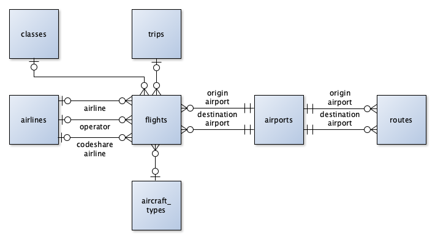

# Flight Log Data Schema

The flight log data uses a [GeoPackage file](https://www.geopackage.org/) containing flight log data for a single traveler.

## GeoPackage Layers

> [!NOTE]
> Columns use the data types specified in the GeoPackage Encoding Standards [Table 1. GeoPackage Data Types](https://www.geopackage.org/spec/#table_column_data_types), and geometry types specified in [Annex G: Geometry Types (Normative)](https://www.geopackage.org/spec/#geometry_types). Optional fields must be null when unused.

### aircraft_types (No Geometry)

The `aircraft_types` table contains records of aircraft types that `flights` have used.

| Column | Data Type | Description |
|--------|-----------|-------------|
| `fid` | INT (64 bit) | Primary key for the airline record. |
| `manufacturer` | TEXT | The manufacturer of the aircraft type (e.g. `Boeing`).
| `name` | TEXT | The name of the aircraft type (e.g. `737-800`) |
| `icao_code` | TEXT | ICAO code for the airline (e.g. `B738`). |
| `iata_code` | TEXT | IATA code for the airline (e.g. `738`). |
| `family` | TEXT | Family the aircraft type belongs to (e.g. `Boeing 737`). Used for grouping aircraft types. |
| `category` | TEXT | `wide_body`, `narrow_body`, `regional_jet`, or `turboprop` |

### airlines (No Geometry)

The `airlines` table contains records of airlines that `flights` have used as their marketing carrier, operator, or codeshare.

| Column | Data Type | Description |
|--------|-----------|-------------|
| `fid` | INT (64 bit) | Primary key for the airline record. |
| `name` | TEXT | The name of the airline (e.g. `American`). |
| `icao_code` | TEXT | ICAO code for the airline (e.g. `AAL`). |
| `iata_code` | TEXT | IATA code for the airline (e.g. `AA`). |
| `numeric_code` | TEXT | *Optional.* The three-digit numeric code for the airline (e.g. `001`) |
| `is_only_operator` | BOOLEAN | True if an airline only operates flights for other airlines, false if it operates flights as its own marketing carrier. (See [Airline Types](#airline-types).) |
| `is_defunct` | BOOLEAN | True if an airline is no longer in use, false otherwise. When looking up airlines, defunct airlines will be ignored. This is helpful in situations where current airlines use the same codes as an old airline (for example, the current PSA Airlines and the defunct Comair both use the IATA code `OH`.) |

#### Airline Types

The airlines table is used in multiple contexts - to represent marketing airlines, operating airline, codeshare airlines.

Not all flights are operated by the airline that sold the ticket. In some cases, mainline airlines will subcontract to a regional subsidiary to actually run the flight. For example, many American Airlines regional flights are actually operated by Envoy Air. In this case, the **marketing airline** would be American Airlines, and the **operating airline** would be Envoy Air.

(If you're on an American Airlines flight that they actually operate themselves, then *both* the marketing airline and operating airline would be American Airlines.)

Additionally, sometimes mainline airlines will sell tickets for connecting flights on other mainline airlines' flights, particularly if they're in the same airline alliance. This is common on international itineraries, but can happen domestically as well. As an example, I could buy an itinerary on American Airlines with a flight from Dayton to Chicago O'Hare, and then on to London Heathrow. If that Chicago to London flight is actually a British Airways flight with its own flight number, then the **marketing airline** is British Airways, and the **codeshare airline** is American Airlines.

It's technically possible to have a flight with all three airline types, if you buy an itinerary with a flight operated by another airline's regional subsidiary.

### airports (Point)

The `airports` table contains records of airports that `flights` have used.

| Column | Data Type | Description |
|--------|-----------|-------------|
| `fid` | INT (64 bit) | Primary key for the airport record. |
| `name` | TEXT | The name of the airport. For commercial airports, use the name that would show up on a flight board, which is typically the primary city or region the airport serves (e.g. `Atlanta`, `Dallas/Fort Worth`). If this is ambiguous, include the airport name in parentheses (e.g. `Chicago (O’Hare)`, `Chicago (Midway)`). |
| `country` | TEXT | The country the airport is located in, in ISO 3166-1 alpha-2 format (e.g. `US`). |
| `icao_code` | TEXT | *Optional.* ICAO code for the airport (e.g. `KATL`). |
| `iata_code` | TEXT | *Optional.* IATA code for the airport (e.g. `ATL`). |
| `faa_lid` | TEXT | *Optional.* FAA location identifier for the airport (e.g. `ATL`, `I73`). |
| `time_zone` | TEXT | IANA (tz) time zone for the airport (e.g. `America/New_York`). |
| `is_defunct` | BOOLEAN | True if an airport is no longer in use, false otherwise. When looking up airports, defunct airports will be ignored. This is helpful in situations where current airports use the same codes as an old airport (for example, the modern Denver airport and the old Denver Stapleton both use `KDEN`/`DEN`.) |

### classes (No Geometry)

The `classes` table contains definition of travel classes such as Economy and First.

| Column | Data Type | Description |
|--------|-----------|-------------|
| `fid` | INT (64 bit) | Primary key for the class record. |
| `quality` | INT (64 bit) | Quality order of the class, with `1` as the lowest and higher being better. |
| `name` | TEXT | Name of the class (e.g. `Economy`) |
| `description` | TEXT | Description of the class (e.g. `Standard main cabin seat`) |

### flights (MultiLineStringZ)

The `flights` table contains records of individual flights.

Individual flights may or may not have geometry (e.g., older flights without known tracks). If altitudes are present, they should use meters as units.

| Column | Data Type | Description |
|--------|-----------|-------------|
| `fid`  | INT (64 bit) | Primary key for the flight record. |
| `departure_utc` | DATETIME | UTC departure time for the flight. Prefer gate out time over wheels off (up) time. Prefer actual time over estimated time over scheduled time. |
| `arrival_utc` | DATETIME | *Optional.* UTC arrival time for the flight. Prefer gate in time over wheels on (down) time. Prefer actual time over estimated time over scheduled time. |
| `purpose` | TEXT | `Business`, `Personal`, or `Mixed` |
| `trip_fid` | INT (64 bit) | *Optional.* Foreign key referencing the trip on the [`trips`](#trips-no-geometry) table. |
| `trip_section` | INT (64 bit) | *Optional.* Flights which follow each other after a layover should be assigned the same trip section of the same trip. Used to avoid [double-counting visits to airports during layovers](https://paulbogard.net/flight-historian/counting-visits-to-airports-the-significance-of-trip-sections/). |
| `airline_fid` | INT (64 bit) | *Optional.* Foreign key referencing the marketing airline on the [`airlines`](#airlines-no-geometry) table. (See [Airline Types](#airline-types).) |
| `flight_number` | TEXT | The marketing airline's flight number for the flight. (See [Airline Types](#airline-types).) |
| `origin_airport_fid` | INT (64 bit) | Foreign key referencing the origin airport on the [`airports`](#airports-point) table. |
| `destination_airport_fid` | INT (64 bit) | Foreign key referencing the destination airport on the [`airports`](#airports-point) table. |
| `aircraft_type_fid` | INT (64 bit) | *Optional.* Foreign key referencing the aircraft type on the [`aircraft_types`](#aircraft_types-no-geometry) table. |
| `tail_number` | TEXT | *Optional.* The tail number of the aircraft operating the flight (e.g. `N909EV`). |
| `class_fid` | INT (64 bit) | *Optional.* Foreign key referencing the travel class on the [`classes`](#classes-no-geometry) table. |
| `operator_fid` | INT (64 bit) | *Optional.* Foreign key referencing the marketing airline on the [`airlines`](#airlines-no-geometry) table. May or may not be the same as the `airline_fid`. (See [Airline Types](#airline-types).) |
| `codeshare_airline_fid` | INT (64 bit) | *Optional.* Foreign key referencing the codeshare airline on the [`airlines`](#airlines-no-geometry) table. (See [Airline Types](#airline-types).) |
| `codeshare_flight_number` | TEXT | *Optional.* The codeshare airline's flight number for the flight. (See [Airline Types](#airline-types).) |
| `distance_mi` | INT (64 bit) | *Optional.* Distance of the flight in miles. Includes taxiing (ground) distance when available.
| `aircraft_name` | TEXT | *Optional.* Name of the specific aircraft operating the flight (e.g. `Salmon-Thirty-Salmon II`). |
| `boarding_pass_data` | TEXT | *Optional.* Boarding pass data string in IATA BCBP format. |
| `fh_id` | INT (64 bit) | *Optional.* Flight Historian flight record ID. |
| `geom_source` | TEXT | *Optional.* Source of geometry data for this flight (e.g. `FlightAware`, `GPS`).
| `fa_flight_id` | TEXT | *Optional.* FlightAware AeroAPI ID string. |
| `fa_json` | TEXT | *Optional.* A JSON array containing one or more AeroAPI flight lookup JSON responses. (Multiple JSON responses may be necessary for diverts. Most flights will only have a single JSON response in the array.) |
| `comments` | TEXT | *Optional.* Comments about the flight. |

### routes (MultiLineString)

The `routes` table contains great circle geometry for routes between pairs of airports.

> [!WARNING]
> The routes table is automatically generated and updated. (An update can be forced with the [`refresh routes`](../README.md#refresh-routes) command.) Do not manually edit the routes table, as any edits will be lost when routes are updated.

| Column | Data Type | Description |
|--------|-----------|-------------|
| `fid`  | INT (64 bit) | Primary key for the route record. |
| `origin_airport_fid` | INT (64 bit) | Foreign key referencing the origin airport on the [`airports`](#airports-point) table. |
| `destination_airport_fid` | INT (64 bit) | Foreign key referencing the destination airport on the [`airports`](#airports-point) table. |
| `flight_count` | INT (64 bit) | Number of flights flown in this direction of this route. |
| `distance_mi` | INT (64 bit) | Geodesic distance of this route in miles. |

### trips (No Geometry)

The `trips` table contains records for trips that flights belong to.

| Column | Data Type | Description |
|--------|-----------|-------------|
| `fid`  | INT (64 bit) | Primary key for the route record. |
| `name` | TEXT | Name of the trip. |
| `start_date` | DATE | Start date of the trip in the local time zone of the departure location.
| `end_date` | DATE | End date of the trip in the local time zone of the trip completion location.
| `comments` | TEXT | *Optional.* Comments about the trip. |
