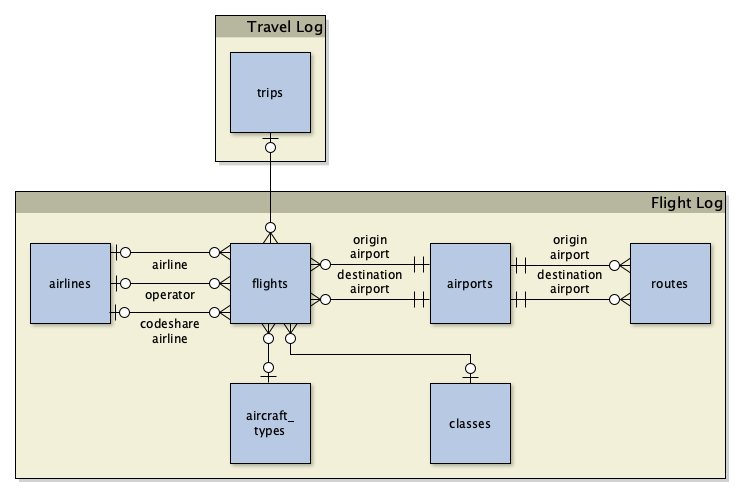

# PBTravelLog Schema

PBTravelLog stores travel history in multiple GeoPackage files.

## Travel Log

[Travel Log Schema](travel_log.md)

The Travel Log GeoPackage contains tables of entities that don't belong to a specific mode of travel, or involve multiple modes of travel.

- Trips

## Flight Log

[Flight Log Schema](flight_log.md)

The Flight Log GeoPackage contains tables of entities related to flights.

- Flights
- Aircraft types
- Airlines
- Airports
- Seat classes
- Routes