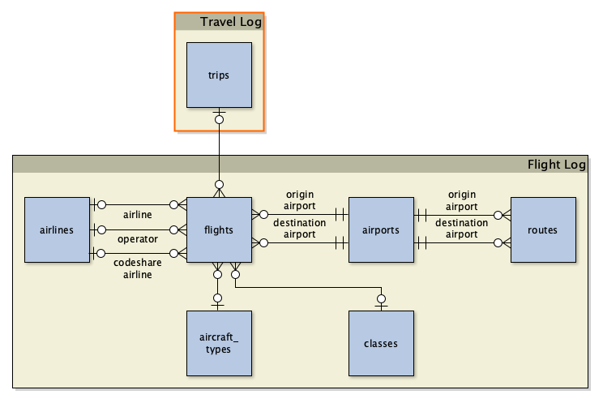

# Travel Log Data Schema

The travel log data uses a [GeoPackage file](https://www.geopackage.org/) containing travel log data for a single traveler. (Travel log data is data that doesn't fall under a specific travel mode.)

## GeoPackage Layers

> [!NOTE]
> Columns use the data types specified in the GeoPackage Encoding Standards [Table 1. GeoPackage Data Types](https://www.geopackage.org/spec/#table_column_data_types), and geometry types specified in [Annex G: Geometry Types (Normative)](https://www.geopackage.org/spec/#geometry_types). Optional fields must be null when unused.

### trips (No Geometry)

The `trips` table contains records for trips that flights belong to.

| Column | Data Type | Description |
|--------|-----------|-------------|
| `fid`  | INT (64 bit) | Primary key for the route record. |
| `name` | TEXT | Name of the trip. |
| `start_date` | DATE | Start date of the trip in the local time zone of the departure location.
| `end_date` | DATE | End date of the trip in the local time zone of the trip completion location.
| `comments` | TEXT | *Optional.* Comments about the trip. |
